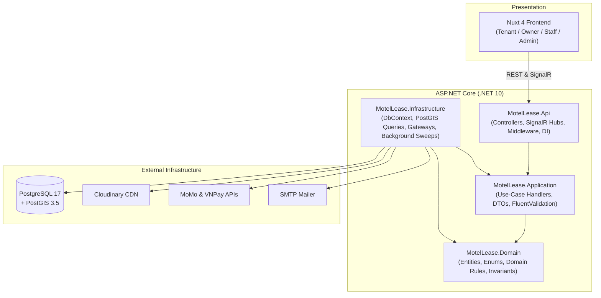

# MotelLease — Boarding House Search & Property Management Platform

[](https://dotnet.microsoft.com/)
[](https://vitest.dev/)
[](https://dotnet.microsoft.com/)
[](https://nuxt.com/)
[](https://postgis.net/)
[](https://www.docker.com/)

A comprehensive, enterprise-grade boarding house discovery and property management platform: tenants find and book rooms via spatial search, owners and their staff run properties, and the monthly billing, contract, and payment lifecycle is handled end to end.

---

## 🏗️ Technology Stack

| Layer | Technology | Key Capabilities |
|---|---|---|
| **Backend API** | **ASP.NET Core (.NET 10)** | C# 13, Clean Architecture, Plain Use-Case Handlers (No MediatR), FluentValidation, Rate Limiting, Global Error Handling |
| **Data Persistence** | **EF Core 10 + Npgsql** | PostgreSQL 17 + PostGIS 3.5, GiST Spatial Indexing, STORED Generated Columns, Soft Delete with Partial Unique Indexes |
| **Realtime & Docs** | **SignalR + QuestPDF** | WebSockets Push Notifications (`/hubs/notifications`), Vector PDF Invoice Generation (`QuestPDF`) |
| **Frontend Portal** | **Nuxt 4 + Vue 3** | Single SSR/SPA app serving 4 role portals, Vite, Tailwind CSS, Pinia, `@nuxtjs/i18n` (`vi` default, `en`), Dark Mode |
| **Interactive Maps** | **Leaflet & OpenStreetMap** | PostGIS Bounding-Box Discovery, Radius Sliders, Custom Map Markers & Popups |
| **Media Storage** | **Cloudinary** | Signed Direct Client Uploads, SHA-1 Signature Generation, Multi-image attachments |
| **Payment Gateways** | **MoMo & VNPay** | Server-to-Server HMAC-SHA512 IPN Webhooks, Idempotent Transaction Ledgers |
| **DevOps & Containers** | **Docker & Compose** | Multi-stage Container Builds, PostGIS 17 Engine, pgAdmin 4, ngrok Webhook Tunnel |

---

## 🏛️ Clean Architecture & Inward Layering

The solution strictly enforces inward dependency direction: `Api → Application → Domain` and `Infrastructure → Application → Domain`. The `Domain` project has **zero** dependencies on EF Core, ASP.NET, or I/O.



---

## 🛡️ Core Domain Invariants & Business Safeguards

These architectural invariants are strictly enforced across the domain model and verified by integration tests:

1. **Exact Financial Precision**: All monetary values are represented as `decimal(18,2)` — floating-point arithmetic is prohibited.
2. **PostGIS Spatial Integrity**: Boarding house coordinates are stored as `geography(Point, 4326)` in a STORED generated column with GiST indexes. Spatial queries use longitude-first `ST_MakePoint(longitude, latitude)`.
3. **Soft Deletion with Partial Indexes**: Soft-deleted entities use `IsDeleted` with EF Core global query filters. Every unique index on soft-deletable tables is a partial index (`WHERE "IsDeleted" = false`).
4. **Idempotent Financial Operations**: Payment IPN callbacks verify HMAC-SHA512 signatures and enforce unique `PaymentTransaction.ProviderTxnId`. Duplicate callbacks never modify balances twice.
5. **Frozen Historical Documents**: Invoices and lease contracts freeze historical room and utility prices at issuance time, ensuring future property price updates never alter past tenant dues.
6. **Exact Bill Splitting**: Multi-tenant utility and room bill splits are computed down to 1 VNĐ with remainder adjustment.
7. **Resource-Based Authorization**: Landlords and assigned staff can only manage properties they own or have been explicitly delegated via `BoardingHouseAccess.Managed()`.

---

## 🌟 Multi-Role Portals & Functional Scope

The system provides 4 dedicated role-based portals within a single responsive Nuxt 4 application:

### 1. 👤 Tenant Portal
- **Spatial Discovery & Maps**: Search boarding houses "Near Me", filter by distance radius (1–30 km), price range, room type, and facilities. Interactive Leaflet map with bounding-box auto-fetching.
- **Viewing Appointments**: Request property tour slots, view appointment statuses, and receive real-time notifications.
- **24h Room Holding Deposits**: Reserve available rooms with 24-hour expiry workers, preview draft lease terms, and pay holding deposits via MoMo or VNPay.
- **Check-in & Confirm-to-Lease**: Seamlessly transition from deposit holder to active tenant upon room move-in.
- **Lease Lifecycle & Co-Tenants**: View rental contract terms, view co-tenants, submit lease extension requests, and view real-time move-out settlement breakdowns.
- **Monthly Utility Bills & Rent Checkout**: View itemized electric and water consumption, room fees, split shares, pay online via MoMo / VNPay, and download official QuestPDF invoices.
- **Maintenance Incident Reporting**: Submit room repair requests with category tags (`Electrical`, `Plumbing`, `Furniture`, `Appliances`, `Internet`, `Other`) and photo attachments.
- **Saved Listings**: Bookmark favorite boarding houses for fast reference.

### 2. 🏠 Landlord / Owner Portal
- **Property & Room Management**: Full CRUD for boarding houses, room categories, pricing tiers, capacity, photo galleries, and facility badges.
- **Utility Meter Logging & Rates**: Configure electricity/water pricing models and log monthly meter readings with automatic cost computation.
- **Viewing Appointments & Deposit Reviews**: Review incoming tour requests and holding deposits (`Approve` / `Reject`).
- **Rental Leases & Co-Tenants**: Oversee active, expiring, and terminated leases, review extension requests, and execute move-out settlement refunds and deductions.
- **Bill Generation & QuestPDF Invoicing**: Issue monthly bills for individual rooms, track collection status, and generate vector PDF bills (`GET /api/v1/bills/{id}/pdf`).
- **Operating Expenses & Master Meters**: Log master electricity/water meters and miscellaneous operational expenses.
- **12-Month Financial Analytics Suite**: Visual revenue vs. expenses bar charts, occupancy doughnut charts, and property-level KPI cards.
- **Staff Delegation**: Create staff accounts, delegate managed properties, and control account access.
- **Ledger Balance & Withdrawals**: Track real-time wallet balance and request bank withdrawals with balance validation.

### 3. 🛠️ Staff Portal
- **Managed Properties Overview**: Restricted view showing only properties explicitly assigned by the owner.
- **Work Tasks Delegation**: Prioritized task tracking (`Urgent`, `High`, `Medium`, `Low`) with due dates and status workflow (`Pending` ➔ `InProgress` ➔ `Completed`).
- **On-Site Operational Support**: Assist in viewing tours and coordinate maintenance resolutions.

### 4. 🛡️ Admin Portal
- **Platform Analytics & KPIs**: System-wide counts of users, boarding houses, rooms, active leases, and transaction volumes.
- **User Account Management**: Global search across all accounts, lock/unlock users, and provision administrative accounts.
- **Standard Facilities Catalogue**: Manage standard room facilities dictionary with real-time usage counters.
- **Financial Disbursements**: Review and approve landlord bank withdrawal requests.
- **Violation Reports Moderation**: Moderate tenant/landlord reports (`Resolve` / `Dismiss`).
- **Audit Logs Trail**: Complete, tamper-evident audit logging for sensitive platform actions.

---

## 📂 Project Structure

```
motellease/
├── backend/
│   ├── MotelLease.Api/              # Controllers, SignalR hubs, auth middleware, DI wiring
│   ├── MotelLease.Application/      # Use-case handlers, DTOs, FluentValidation rules
│   ├── MotelLease.Domain/           # Pure entities, value objects, enums, business invariants
│   ├── MotelLease.Infrastructure/   # DbContext, EF Core mappings, Cloudinary, MoMo, VNPay, Sweeps
│   ├── MotelLease.Tests/            # Integration test suite powered by Testcontainers & PostGIS
│   ├── MotelLease.slnx              # Modern .NET solution file
│   └── Dockerfile                   # Multi-stage ASP.NET Core production build
├── frontend/
│   ├── layouts/                     # Role layouts: default, tenant, owner, staff, admin, auth
│   ├── pages/                       # Nuxt 4 pages (auth, tenant, owner, staff, admin, search)
│   ├── components/                  # Reusable UI components, modals, filters, and charts
│   ├── composables/                 # useApi, useAuth, useFormat, useSignalR, useTheme, useToast
│   ├── stores/                      # Pinia state stores (auth, toast, notification)
│   ├── test/                        # Vitest automated test suites across all 8 phases
│   ├── locales/                     # Bilingual i18n message catalogs (vi, en)
│   ├── nuxt.config.ts               # Nuxt 4 configuration & modules
│   └── Dockerfile                   # Multi-stage Nuxt SSR production build
├── docs/                            # Project specifications (Vietnamese source of truth)
│   ├── features.md                  # Detailed feature matrix & state machines
│   ├── erd.md                       # 29-table database ERD & spatial indexing
│   ├── domain-rules.md              # 12 core domain invariants & business rules
│   ├── api-design.md                # Complete REST API endpoint contracts (~150 endpoints)
│   └── seed-plan.md                 # Realistic seed data and coordinate anchors
├── docker-compose.yml               # Complete container orchestration
└── run-dev.sh                       # Local development startup script
```

---

## 🧪 Testing & Verification

The project includes complete test suites for both backend and frontend:

### Backend Integration Tests (100% Passing)
- **Engine**: **xUnit** + **Testcontainers** running `postgis/postgis:17-3.5`.
- **Coverage**: **144 / 144 tests passed**.
- **Scope**: All 12 domain invariants from `docs/domain-rules.md` §9, state machines, financial transactions, spatial proximity queries, and QuestPDF generation.
- **Run command**:
  ```bash
  dotnet test backend/MotelLease.slnx
  ```

### Frontend Automated Tests (100% Passing)
- **Engine**: **Vitest** + **@vue/test-utils** + **happy-dom**.
- **Coverage**: **67 / 67 tests passed across 29 test suites**.
- **Scope**: Form validation, modal submission lifecycles, API DTO payload assertions, role authentication guards, and i18n completeness.
- **Run command**:
  ```bash
  npm --prefix frontend test
  ```

### Production Build Verification
- Nuxt 4 SSR production build compiles cleanly:
  ```bash
  npm --prefix frontend run build
  ```

---

## 🚀 Getting Started

### Option A: One-Command Stack with Docker Compose (Recommended)

Start the entire application stack (PostGIS Database + .NET 10 API + Nuxt 4 Frontend):

```bash
docker compose up --build -d
```

- **Frontend App**: `http://localhost:3000`
- **Backend API & Swagger UI**: `http://localhost:5004/swagger`
- **PostGIS Database**: `localhost:5432` (`motellease` / `motellease`)

#### Optional Docker Profiles:
```bash
# Start pgAdmin web management UI on http://localhost:5050
docker compose --profile tools up -d

# Start ngrok tunnel on http://localhost:4040 for local payment IPN callbacks
docker compose --profile tunnel up -d
```

---

### Option B: Local Development Setup

#### Prerequisites
- [.NET 10 SDK](https://dotnet.microsoft.com/download)
- [Node.js 22+](https://nodejs.org/)
- [Docker](https://www.docker.com/) (for PostgreSQL / PostGIS)

#### 1. Database & Backend API
```bash
# 1. Start PostgreSQL with PostGIS
docker compose up db -d

# 2. Configure secrets in user-secrets
cd backend/MotelLease.Api
dotnet user-secrets set "Jwt:SigningKey" "a-very-secret-and-secure-key-with-at-least-32-bytes"

# (Optional) Configure Google OAuth & payment gateways
dotnet user-secrets set "GoogleAuth:ClientId" "<your-google-client-id>.apps.googleusercontent.com"
dotnet user-secrets set "VnPay:TmnCode" "<your-tmn-code>"
dotnet user-secrets set "VnPay:HashSecret" "<your-hash-secret>"
dotnet user-secrets set "MoMo:PartnerCode" "MOMO"
dotnet user-secrets set "MoMo:AccessKey" "<your-access-key>"
dotnet user-secrets set "MoMo:SecretKey" "<your-secret-key>"

# 3. Run API (Database auto-migrates and seeds on startup)
dotnet run
```

#### 2. Frontend Development Server
```bash
# Navigate to frontend
cd frontend

# Install dependencies
npm install

# Run frontend test suite
npm test

# Start Nuxt 4 development server with HMR
npm run dev
```

#### 3. Development Runner Script
Alternatively, run both backend and frontend together with a single script:
```bash
./run-dev.sh
```

---

## 📚 Specification Reference

| Document | Description |
|---|---|
| [docs/features.md](docs/features.md) | Feature matrix, priority breakdown, and role state machines |
| [docs/erd.md](docs/erd.md) | Database ERD, 29 tables, spatial geometries, indexes, and constraints |
| [docs/domain-rules.md](docs/domain-rules.md) | Business logic specifications and 12 core domain invariants |
| [docs/api-design.md](docs/api-design.md) | REST API endpoint contracts and request/response DTOs (~150 endpoints) |
| [docs/seed-plan.md](docs/seed-plan.md) | Realistic seed dataset, Hanoi anchor coordinates, and test accounts |


